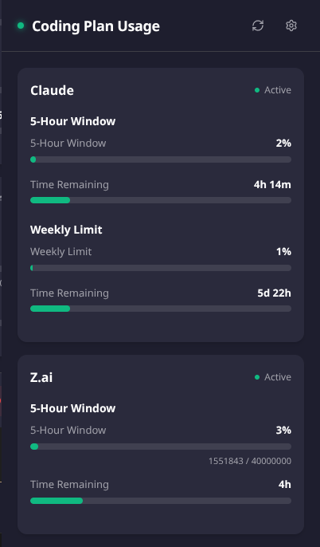
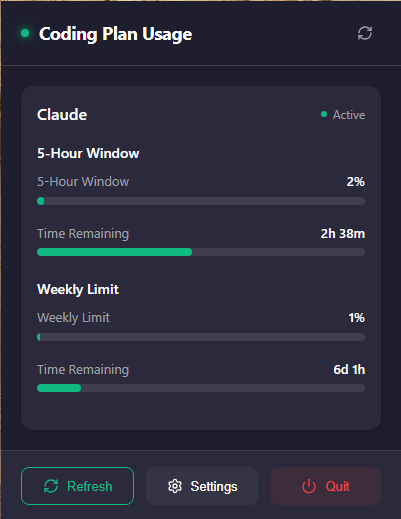
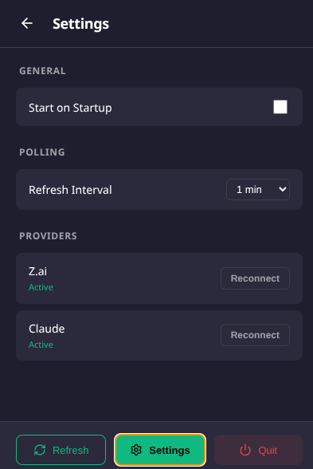

# Coding Plan Usage

Coding Plan Usage is a system tray application that tracks usage quotas for coding subscriptions. It sits quietly in your tray and provides quick access to your usage stats.
Current supported providers are Z.ai and Claude.ai.

## 📋 Table of Contents

- [Screenshots](#-screenshots)
- [How it Works (Transparency)](#-how-it-works-transparency)
- [Getting Started](#-getting-started)
- [Installation](#-installation)
- [Development](#-development)
- [Building](#-building)
- [Version Management](#-version-management)
- [Release Process](#-release-process)
- [Tech Stack](#-tech-stack)

## 📸 Screenshots

### Dashboard View - 2 Providers



### Dashboard View - 1 Provider



### Settings Panel



## 🔍 How it Works (Transparency)

This application operates by using a secure, hidden browser window (powered by Electron) to log in to the provider's website. It captures session cookies and usage data strictly within your local environment.

**Important**: All data, including session cookies and usage statistics, is stored locally on your machine. No sensitive information is transmitted to any external servers other than the service providers themselves (Z.ai/Claude.ai) for the purpose of fetching your usage data.

## 🚀 Getting Started

### Connecting Your Providers

Follow these steps to connect Z.ai or Claude to the Coding Plan Usage:

1. **Open Settings**
   - Click the Settings button in the application

2. **Initiate Connection**
   - In the "Providers" section, click the "Connect" button next to either Z.ai or Claude

3. **Browser Authentication**
   - A browser window will automatically open
   - Sign in to your account using your normal credentials

4. **Navigate to Usage Page** ⚠️ **Important Step**
   - After signing in, you must navigate to the usage page for the app to capture your session:
     - **For Z.ai**: Go to `https://z.ai/manage-apikey/subscription`
     - **For Claude**: Go to `https://claude.ai/settings/usage`

5. **Automatic Detection**
   - The app will automatically detect and save your session cookies
   - The browser window will close automatically once the session is captured

6. **Verify Connection**
   - Return to the Settings panel
   - You should see the provider marked as "Active"
   - Usage stats will now appear in the dashboard

### Using the Application

Once connected, Coding Plan Usage will:

- Display real-time usage statistics for connected providers
- Show percentage used and time remaining
- Update automatically based on your configured polling interval
- Sit quietly in your system tray for quick access

## 🛠️ Development

To start the application in development mode (React dev server + Electron):

```bash
npm run dev
```

## 📦 Building

To build the application for your operating system:

```bash
npm run dist
```

### Platform Specific Builds

- **Windows**: `npm run dist:win`
- **Linux**: `npm run dist:linux`

## 🏷️ Version Management

**⚠️ IMPORTANT: DO NOT edit the `version` field in package.json manually.**

The version is automatically generated from git tags by the version management scripts.

### How Versioning Works

The version is derived from your git state:

- **On a clean tag**: `0.0.5` (official release version)

  ```bash
  git tag v0.0.5
  ```

  → Version: `0.0.5`

- **Ahead of a tag**: `0.0.5-dev.3+abc1234` (development version)

  ```bash
  # 3 commits ahead of v0.0.5
  git log --oneline v0.0.5..HEAD  # shows 3 commits
  ```

  → Version: `0.0.5-dev.3+abc1234`

- **Dirty working directory**: `0.0.5-dirty` (uncommitted changes)

  ```bash
  # Uncommitted changes present
  git status
  ```

  → Version: `0.0.5-dirty`

- **No tags yet**: `0.0.0-dev+abc1234` (initial development)
  ```bash
  # Repository has no version tags
  git tag  # (empty)
  ```
  → Version: `0.0.0-dev+abc1234`

### Version Scripts

The project includes two npm scripts for version management:

- `npm run version:get` - Display the current version without modifying files

  ```bash
  $ npm run version:get
  0.0.5-dev.3+abc1234
  ```

- `npm run version:stamp` - Update package.json with the current version
  ```bash
  $ npm run version:stamp
  ✓ Version stamped: 0.0.5-dev.3+abc1234
  ```

### Automatic Version Stamping

The version is automatically stamped before building:

- `npm run build` runs `version:stamp` automatically
- `npm run dist` runs `version:stamp` automatically

This ensures that every build has the correct version based on your git state.

### Best Practices

1. **Use git tags as the single source of truth**
   - All versioning is derived from git tags
   - The `version` field in package.json is always auto-generated

2. **Tag releases consistently**

   ```bash
   git tag v1.0.0
   git push origin v1.0.0
   ```

3. **Check version before releases**

   ```bash
   npm run version:get
   ```

4. **Never edit package.json version manually**
   - It will be overwritten by `version:stamp`
   - Use git tags to control versioning

## 🚀 Release Process

Automated releases are handled via GitHub Actions when a new version tag is pushed.

### Creating a Release

1.  **Verify the version**:

    ```bash
    npm run version:get
    # Should show the clean tag version, e.g., 1.0.0
    ```

2.  **Tag the release**:

    ```bash
    git tag v1.0.0
    git push origin v1.0.0
    ```

3.  **Monitor the build**:
    - Go to the [Actions tab](https://github.com/dan-jeff/coding-plan-usage/actions) on GitHub.
    - Watch the "Release" workflow run automatically.

4.  **Download assets**:
    - Once completed, the new version will appear in [Releases](https://github.com/dan-jeff/coding-plan-usage/releases).
    - Assets include:
      - `Usage.Tray.Setup.x.x.x.exe` (Windows Installer)
      - `Usage.Tray-x.x.x.AppImage` (Linux AppImage)
      - `usage-tray_x.x.x_amd64.deb` (Linux Debian Package)

### What Happens During Release

The GitHub Actions workflow (`.github/workflows/release.yml`):

1. **Checks out the code** at the tag
2. **Runs version:stamp** to ensure correct version in package.json
3. **Builds the application** for Windows and Linux
4. **Creates a GitHub Release** with build artifacts
5. **Publishes the release** to the Releases page

### Pre-release Testing

Before tagging a release, you can test locally:

```bash
# Build and test locally
npm run build
npm run dist

# Verify version in built app
# The built application will show the correct version from package.json
```

## 🔧 Tech Stack

- **Electron**: Desktop application framework
- **React**: UI library
- **TypeScript**: Static typing
- **Vite**: Build tool and dev server
